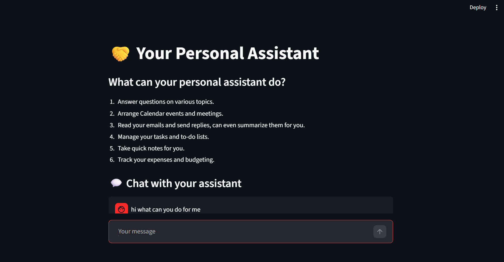
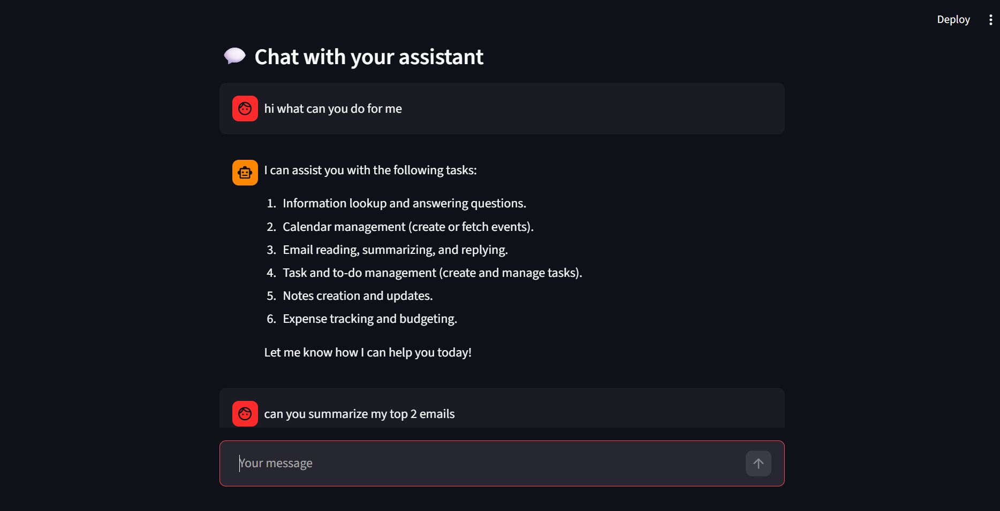
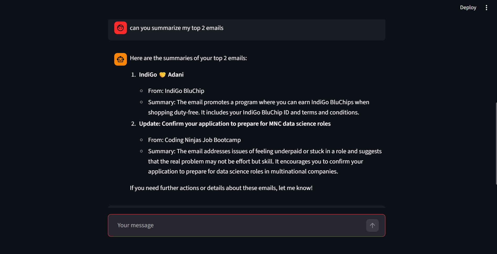
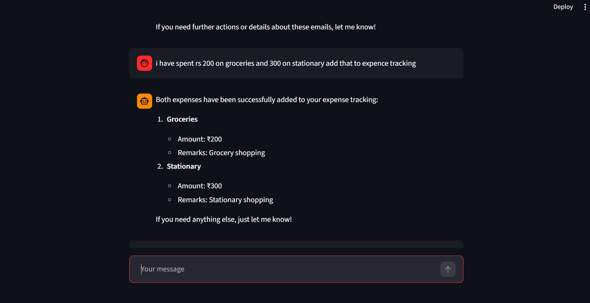

# 🤖 AI Personal Assistant (n8n + Streamlit)

An AI-powered personal assistant built using **n8n workflows** and a **Streamlit chat interface**, capable of automating daily tasks and retrieving real-time information using web search.

## 🚀 Features

* 💬 Chat-based AI assistant
* 🌐 Web search for real-time information
* 📅 Schedule and manage calendar events
* 📧 Read, summarize, and send emails
* ✅ Create and manage tasks
* 📝 Take and update notes
* 💰 Track expenses

## 🛠️ Tech Stack

* **Frontend:** Streamlit
* **Backend Automation:** n8n
* **AI Model:** LLM (via API integration)
* **Integration:** Webhooks, Web Search API

## 📸 App Screenshots

### 💬 Chat Interface

## ⚙️ How It Works

1. User enters a query in the Streamlit chat UI
2. Request is sent to n8n via webhook
3. AI agent processes the query using an LLM
4. If needed, web search is triggered for real-time data
5. Other tools (Gmail, Calendar, Tasks, etc.) are executed
6. Response is returned and displayed in the UI

## 🔁 n8n Workflow

The workflow file is available in the repository.
Import it into n8n and configure your credentials to run the assistant.

## ⚠️ Note

* API keys and credentials are not included
* Users must configure their own integrations

## 👩‍💻 Author

**Devanshi Jindal**
